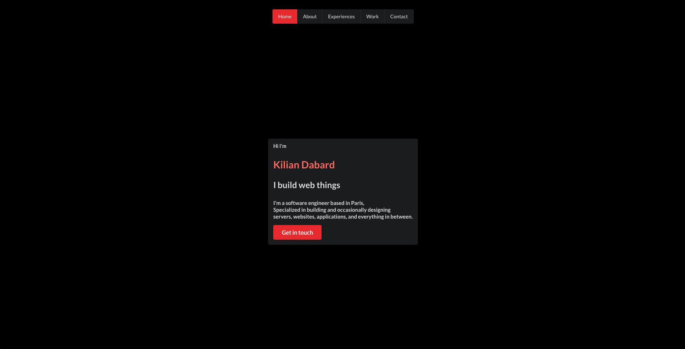

# Purpose
This repository contains a react CRA based on Typescript template.

It is only an implementation of a small library I made that automatically creates a menu depending on pages inside a certain folder.
This library is located in : `src/pages/tools/pages.tsx`

## Why
I wanted to remember how to implement my own library before uploading it to npm.
This will maybe be an exemple of usage later on.

### Physics engine result preview

